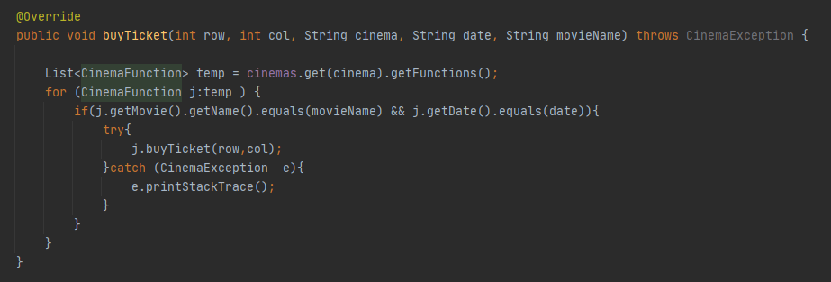
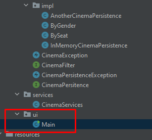

## Parte 1
>
>   1. Configure the application to work under a dependency injection scheme, as shown in the previous diagram. The above requires:
>   
>       - Se hace la inyeccion en las clases AnotherCinemaPersistence y en InMemoryCinemaPersistence
>       - Ademas cinemaServices actua como la capa de servicios de la aplicacion
>
>           
>
>           
>
>           
>
>       - y tambien se tuvo que configurar el archivo applicationContext para que Spring funcionara
>
>           
>
>   2. Complete the getCinemaByName (), buyTicket (), and getFunctionsbyCinemaAndDate () operations. Implement everything required from the lower layers (for now, the available persistence scheme 'InMemoryCinemasPersistence') by adding the corresponding tests in 'InMemoryPersistenceTest'.
>
>       - Se hacen las implementaciones necesarias y tambien sus pruebas 
>
>           
>
>            
>
>           
>
>   3. Make a program in which you create (through Spring) an instance of CinemaServices, and rectify the functionality of it: register cinemas, consult cinemas, obtain the functions of certain cinema, buy / book tickets, etc.
>
>       - se crea el main y dentro de este se hacen los llamado des las funciones 
>
>           
>   
>           
>
>           
>
>   4. It is wanted that the consultations realize a filtering process of the films to exhibit, said filters look for to give him the facility to the user to see the most suitable films according to his necessity. Adjust the application (adding the abstractions and implementations that you consider) so that the CinemaServices class is injected with one of two possible 'filters' (or possible fut
>
>       - se crea una interfaz CinemaFilter y dos clases que implementan esta lladas BySeat, ByGender, y se inyecta cada una, tambien cinemaServices es la encargada de la aplicacion
>
>           
>
>           
>
>           
>
>           
>
>       - ademas en la clase services se desarrolla el metodo que utiliza cinemaFilter
>
>           
>
>           )
>
>   5. se hicieron las pruebas correspondientes 
>
>       