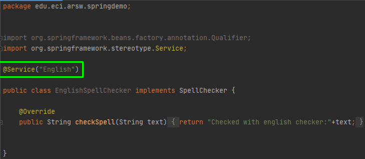
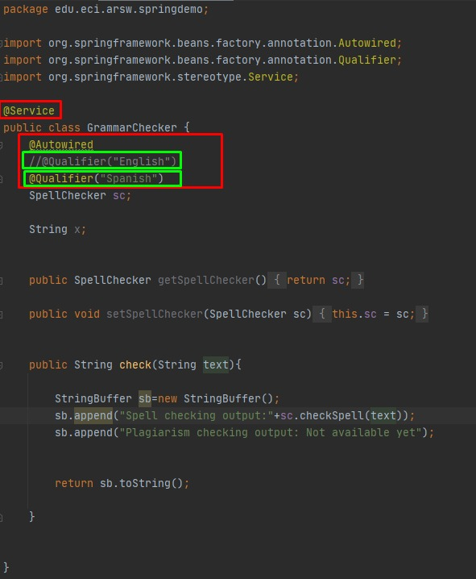
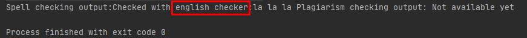
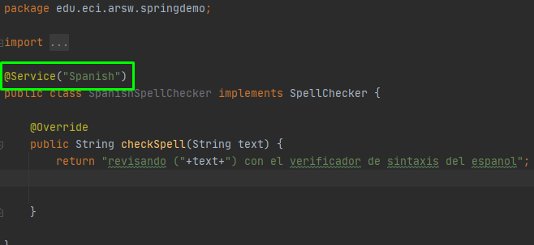
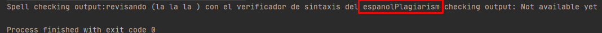

#Parte 1
>
>- Making use of the Spring configuration based on annotations mark with the annotations @Autowired and @Service the dependencies that must be injected, and the 'beans' candidates to be injected -respectively-:
>   1. GrammarChecker will be a bean, which depends on something like 'SpellChecker'.
>   
>       para que la clase quede como bean de spring se usa la anotacion @Service       
>
>       
>
>   2. EnglishSpellChecker and SpanishSpellChecker are the two possible candidates to be injected. One must be selected, or another, but NOT both (there would be dependency resolution conflict). For now, have EnglishSpellChecker used
>
>       Para la primer parte se usa la anotacion @Qualifier("English)
>
>       
>
>- Make a test program, where an instance of GrammarChecker is created by Spring, and use
>   
>   como se puede observar en la imagen se corre la prueba y se usa EnglishSpellChecker
>   
>
#Parte 2
>
>- Modify the configuration with annotations so that the Bean 'GrammarChecker' now makes use of the SpanishSpellChecker class (so that GrammarChecker is injected with EnglishSpellChecker instead of SpanishSpellChecker.) Verify the new result.
>   
>   Para que la clase quede como bean de spring se usa la notacion @Service
>   
>   
>
>   y en el grammar se modifico la anotacion @Qualifier("Spanish")
>
>   
>
>   y el resultado despues de correr la prueba se puede ver que se uso SpanishSpellChecker
>   
>   